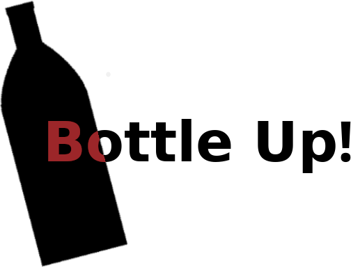

  

An application used to assist restocking fridges, specifically behind a bar.

## Features

* Easy to modify - use +/- buttons or step as needed (i.e. 2 rows = +2)
* "Inverted" count - use the max to deduce amount needed
* Organizable fridge list

## Installation
The project itself should be able to be imported into Android Studio after being cloned.

## Credits

**The Red Lion, Skegness** - for having me :)

**iPaulPro** - for demystifising drag/drop RecyclerViews
